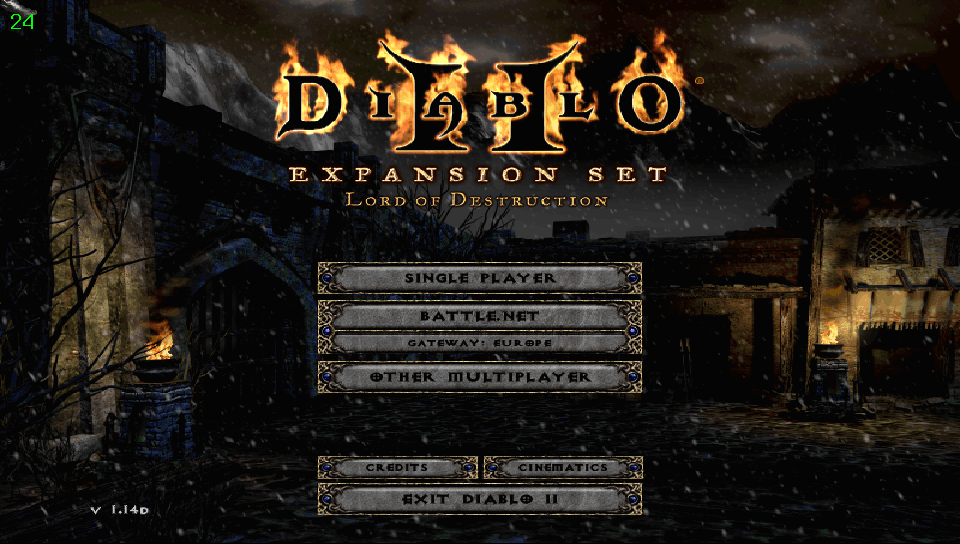

<div align="center">

# D2Vita

**Diablo II: Lord of Destruction, running natively on PlayStation Vita.**

[](https://franckrst.github.io/D2Vita/)
[](LICENSE)

[](https://discord.gg/8tTb7YmDY)



[**Documentation**](https://franckrst.github.io/D2Vita/) · [Installation](https://franckrst.github.io/D2Vita/installation/) · [Roadmap](ROADMAP.md) · [Ground rules](CLAUDE.md) · [Discord](https://discord.gg/8tTb7YmDY)

</div>

---

## What this is

Port of **Diablo II: Lord of Destruction** to the PlayStation Vita.

- **Target:** 960×544 · classic renderer.
- **Strategy:** run the genuine Diablo II: LoD 1.14d `Game.exe` through a Win32/x86 runtime
  (PE loader + import bridge + an x86→ARMv7 dynarec derived from Box86), shimming only the
  OS layer — **run Diablo, don't rewrite Diablo**. An earlier clean-room
  D2MOO+Ghidra-decompilation approach was abandoned before it shipped anything.
- **Status:** boots and plays solo (Rogue Encampment) on real Vita hardware; online play
  (realm → character → game → act) proven end-to-end on console, including against official
  Battle.net. See [ROADMAP.md](ROADMAP.md) for what's done and what's open.

Both the source and compiled VPK releases are public. Read [`CLAUDE.md`](CLAUDE.md) for the ground rules.

> **⚠ Ban risk on official Battle.net.** This runs an unofficial client against Blizzard's
> service, and official access is available by default. Using it on a real account may not
> be permitted under Blizzard's terms of service, and Warden's behavior against this
> runtime — if the server ever pushes it — is not proven. Set `D2_LOCAL_ONLY=1` to restrict
> the client to a private/local server instead. That risk is the player's to accept, not
> something this project guarantees away. See [Online
> play](https://franckrst.github.io/D2Vita/en-ligne/) for exactly what is and isn't proven.

## Community

Looking for beta testers — new builds get shaken out fastest with more people running them
on real hardware. Join the [Discord](https://discord.gg/8tTb7YmDY) to grab pre-release VPKs,
report issues live, and chat with other players. For a confirmed bug or a feature idea,
[open an issue](https://github.com/Franckrst/D2Vita/issues/new/choose) instead — see
[`CONTRIBUTING.md`](CONTRIBUTING.md) for the day-to-day workflow.

## Building

The shipping build does **not** go through CMake — see the header comment in
[`CMakeLists.txt`](CMakeLists.txt) for the authoritative summary. There is no desktop
`d2vita` game binary.

### CMake here: host-side dev tools only

```bash
cmake -B build
cmake --build build -j$(nproc)
```

This builds the StormLib-based MPQ inspection tools (`mpq_grep`, `mpq_probe`, `mpq_hex`,
`mpq_extract`, `mpq_put`, `mpq_rm`) plus whatever the `third_party/winx86` submodule exposes
for desktop checks (its PE analyzer, `pe_analyze`). Requires: gcc/clang, cmake ≥ 3.16.

### PS Vita (shipping VPK)

Two steps, both outside CMake's Vita toolchain path:

```bash
export VITASDK=/usr/local/vitasdk    # adjust to your install path
export PATH="$VITASDK/bin:$PATH"

TARGET=vita bash third_party/winx86/build.sh   # generic engine (ARM static lib): dynarec +
                                                # PE32 loader + Bridge/Cpu + schedulers
bash tools/build_rt_boot_vpk.sh                # D2-specific runtime (tools/rt_boot.cpp +
                                                # src/runtime, src/platform, src/glide_ring),
                                                # linked against libwinx86*.a
                                                # -> build-vita/d2vita.vpk
```

See [`.claude/skills/vitasdk-build/SKILL.md`](.claude/skills/vitasdk-build/SKILL.md) for
the knobs, title IDs, and where game data must sit.

### Desktop repro (dev only, not a game build)

`tools/build_oracle_arm.sh` cross-compiles the same D2-specific runtime + the winx86 dynarec
for `qemu-arm`, letting the actual guest code run on the desktop for fast iteration. See
[`tools/bancs/README.md`](tools/bancs/README.md) for the driving scripts.

Install the VPK on-device with VitaShell (or `tools/push_console.sh` over FTP).

## Data files

D2Vita bundles no Blizzard assets. Provide your own from a legitimate copy of D2 / LoD:

```
ux0:data/d2vita/
├── d2data.mpq      (required)
├── d2exp.mpq       (required, LoD)
├── patch_d2.mpq    (recommended)
├── d2char.mpq
├── d2sfx.mpq
├── d2music.mpq
├── d2xmusic.mpq
├── d2xtalk.mpq
└── d2xvideo.mpq
```

On Vita, the boot diagnostic screen tells you what is missing from `ux0:data/d2vita/`.

## Controls

| Vita input | Diablo II action |
|---|---|
| Left stick | Direct movement (cursor orbits the character + held left click) |
| Right stick | Free mouse, no click |
| Touch screen | Absolute cursor; short tap = left click |
| L (held) | Left click |
| R (held) | Right click (also a combo layer: R+Triangle = virtual keyboard — also opens by itself on text fields — R+D-pad = F1-F4, R+Select = Space) |
| Cross | R — toggle walk/run |
| Circle | Shift (held) — attack in place |
| Square (held) | Alt — show items on the ground |
| Triangle | W — weapon swap |
| D-pad | Belt potions 1-4 |
| Start | Esc |
| Select | Radial menu — skills (T), quests (Q), map (Tab), inventory (I), chat (Enter), party (P), character (C) |

Remappable without a rebuild via `ux0:data/d2vita/controls.txt`. Full detail:
[Controller and keyboard](https://franckrst.github.io/D2Vita/controles/).

## Reference D2 binaries

The genuine Blizzard binary the runtime executes (`Game.exe` 1.14d and its data) is kept
**outside** the repo, currently at `~/d2-vita-refs/1.14d/` (see `tools/bancs/README.md`, which
drives the qemu bench off it). Never committed, never redistributed.

## Project docs

| | |
|---|---|
| [`CLAUDE.md`](CLAUDE.md) | Non-negotiable rules |
| [`ARCHITECTURE.md`](ARCHITECTURE.md) | How the repo fits together with the winx86 engine |
| [`ROADMAP.md`](ROADMAP.md) | Finished and open work — the primary source of truth |
| [Online play](https://franckrst.github.io/D2Vita/en-ligne/) | What's proven online, against both a private test realm and official Battle.net |
| [Fidelity Warden / anti-cheat](https://franckrst.github.io/D2Vita/fidelite-warden/) | How faithfully the runtime represents a real Windows process |
| [`THIRD_PARTY.md`](THIRD_PARTY.md) | Third-party components linked in and their licensing |
| [`.claude/skills/`](.claude/skills/README.md) / [`.claude/agents/`](.claude/agents/) | This port's recipes and task agents (runtime debugging, hardware A/B bench, VitaSDK build, MPQ reading, doc upkeep, online-change validation) — the generic engine's own skills/agents live in [`third_party/winx86/.claude/skills/`](third_party/winx86/.claude/skills/) |

## License

Code you write in this tree: GPL-3.0 (see [LICENSE](LICENSE)). Third-party components under
their own licenses — see [`THIRD_PARTY.md`](THIRD_PARTY.md) for the inventory and what's
required of each before a release.

## Legal

D2Vita is not affiliated with, endorsed by, or sponsored by Blizzard Entertainment. Diablo II
and Diablo II: Lord of Destruction are trademarks of Blizzard Entertainment.
